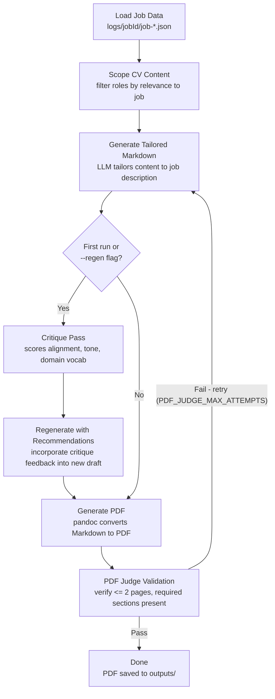

# Resume Generation Pipeline

## Stage Details

| Stage | Agent / Function | Key Output |
|-------|-----------------|------------|
| Load Job Data | `ResumeCreatorAgent.loadJobData()` | company, title, description, salary |
| Scope CV Content | `ResumeCreatorAgent.scopeCVContent()` | filtered roles relevant to job |
| Generate Tailored Markdown | `ResumeCreatorAgent.generateTailoredContent()` | `logs/{jobId}/tailored-*.md` |
| Critique Pass | `ResumeCriticAgent.critiqueResume()` | `logs/{jobId}/critique-*.json` |
| Regenerate with Recommendations | `ResumeCreatorAgent.generateImprovedResume()` | updated tailored markdown |
| Generate PDF | `ResumeCreatorAgent.generatePDF()` via `pandoc` | `outputs/*.pdf` |
| PDF Judge Validation | `ResumePDFJudgeAgent.validatePDF()` | `logs/{jobId}/judge-attempt-*.json` |

## Critique Scoring Weights

| Dimension | Weight |
|-----------|--------|
| Job alignment | 40% |
| Domain vocabulary & tone | 25% |
| Content quality | 20% |
| Company values alignment | 15% |

## Notes

- **Caching**: Subsequent runs reuse cached tailored markdown unless `--regen` is passed
- **Page limit**: PDF Judge enforces ≤ 2 pages; will iteratively condense and retry up to `PDF_JUDGE_MAX_ATTEMPTS` times (default: 2)
- **Modes**: `leader` (default) emphasizes management/strategy; `builder` emphasizes hands-on technical work
- **Format auto-detection**: Chooses standard single-section or split RELEVANT/RELATED sections based on role alignment
